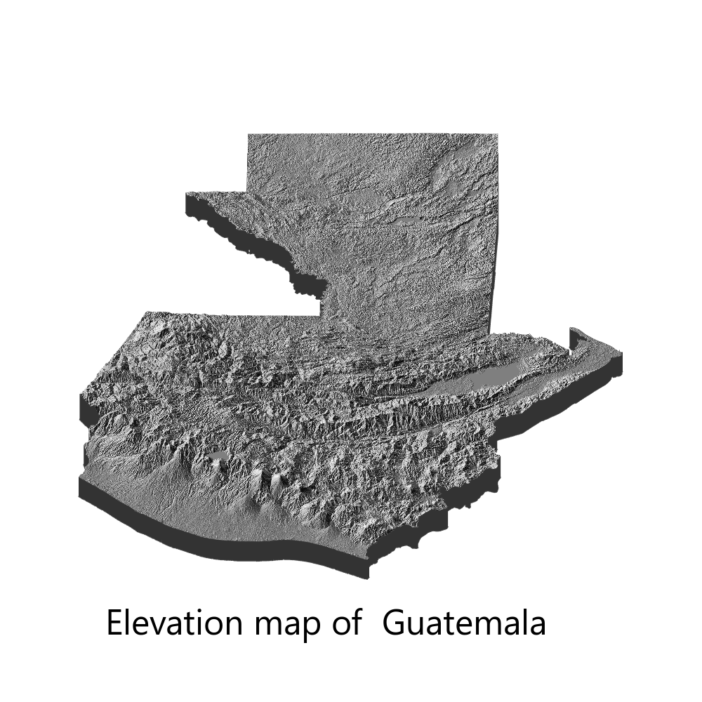

<!-- https://stackoverflow.com/questions/60746090/can-d3-js-visualizations-be-served-using-hugo -->

I have been in a long hiatus from posting anything on my website. Just when I thought I was gaining some momentum with making regular posts a lot of things started to happen (experiments, paper submissions, corrections...). 
So today's post is going to be simple. I saw Amit Levinson's [Tweet](https://twitter.com/Amit_Levinson/status/1457940340149739520) in the #30DayMapChallenge about Israel's 3d elevation map and it inspired me to do something similar. My goal here was to create an elevation map of my home country, Guatemala.

First, I had to get the `sph` file with the map data. I used the data provided by [DIVA_GIS](https://www.diva-gis.org/), unzipped the contents and placed everything in a folder. I am by no means a map expert, but it seems that not only the `.shp` file is necessary to visualize the map; the other files (`dbf`, `prj`, etc) are also necessary. So first we load our packages, and read the map data.

The syntax was hard for me to understand (a geocomputation illiterate), but I found information [here](https://geocompr.robinlovelace.net/spatial-class.html#crs-intro) about the puzzling `4326` in the `st_transform`line. It basically indicates which Coordinate Reference System (CRS)  is to be used (4326 is the code for the Spatial Reference System Identifier EPSG).

```{r,map, eval=FALSE}
library(elevatr)
library(rayshader)
library(sf)
library(here)
library(rgdal)
library(magick)

gtdata<-read_sf("content/blog/2021-11-09-30-day-map-challenge/data/GTM_adm0.shp")

#Transform to st. Spatial Reference System Identifier (SRID). EPSG:4326
gtdata<-st_transform(gtdata,4326)

```

And now we move to the fun part. Using `{rayshader}` we will first get the raster elevation data using `get_elev_raster` and then transform the raster data to a matrix using `raster_to_matrix`. Finally, we will plot the map in 3d and save it.

```{r,plots, eval=FALSE}
#elevation data

gtraster <- get_elev_raster(locations = gtdata, z = 9, clip = "locations")

 #Convert to matrix for rayshader plotting
gtrayshader <- raster_to_matrix(gtraster)

#plot in 3d
gtrayshader %>% 
  sphere_shade(texture = "bw") %>% 
  plot_3d(gtrayshader, zscale = 50, 
          fov = 0, 
          theta = 0, 
          zoom = 0.9, 
          phi = 50, 
          windowsize = c(1000, 1000))

#save it
 
render_snapshot(filename="content/blog/2021-11-09-30-day-map-challenge/Guatemala",
                title_text = "Elevation map of  Guatemala",
                title_offset = c(150,850),
                title_size = 50,
                title_font = 'Helvetica'
                )
```


And the result? This beauty:

{width=100%,height=100%}

And I have to say, achieving this in 9 lines of code (minus loading packages and function options) is truly impressive! You can check the excellent `{rayshader}` documentation [here](https://www.rayshader.com/) here.

Well, that is all for now, but I will be back soon (hopefully) with another post.
