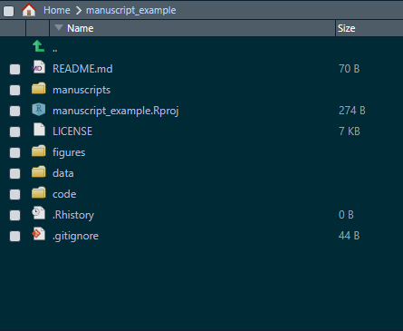

<!-- https://stackoverflow.com/questions/60746090/can-d3-js-visualizations-be-served-using-hugo -->

# Quick Refresher

It took a while for me to get back to this (sorry, a lot of things happening in the world right now). But this is the second entry on my approach on how to use {bookdown} to create a manuscript for a paper in the life sciences (biology, biomedical engineering, etc.).Last time I covered the reasons why we should stop using Word to write papers, and a basic structure for the project. 

I realized I needed to create a Repo to keep track of the steps I am describing here, so if you click on the GitHub on top of this blog entry, it should direct you to the Repo that I will be using as an example. So far, our project looks like this:



We have created a project in R (using RStudio), and have directories for figures, data, code, and manuscripts. In this post, I will cover how we can structure the different sections of the paper.

**Disclaimer** A large part of the motivation for writing these entries about writing a manuscript comes from my desire to keep a record of the things I've done, it is possible that my suggestions here might not align with your needs or your own approach to writing a paper using the tools I describe here. However, I believe the overall description can be useful to people that are interested in creating reproducible documents using R, and you can certainly customize everything to fit your needs!

With that said, let me provide the rationale for the approach I'll follow here.

# The Approach

Let's say that you have now a directory structure like the one in the image above, and you want to start writing the _actual_ paper. If you have already have clean data files, and scripts for your Stats, what usually needs to be iterated (sometimes, a lot) are the paper sections themselves. That is, you might write a section, get some feedback and re-write such section again, but the data and Stats remain the same. If that is the case, one approach that has worked for me is to create another directory inside the _manuscripts_ directory, which will contain the first version of the paper. Let's say we call this new subdirectory _manuscript_v1_. Once you create it, your directory will look like this:


Inside this folder, we create another folder (_sections_) that will contain the file(s) that make the different parts of our manuscript. For example, the typical sections of a paper are:

- Introduction/Background
- Materials and Methods
- Results
- Discussion
- Conclusion

Why do we need to create different files? Having a file for each section makes things a lot easier! (The first time I used {bookdown} I started writing the whole paper on a single file and it gets messy and confusing quickly). 

So let's create another folder inside _manuscript_v1_ called _sections_.

The files that {bookdown} uses to create a document are RMarkdown files (*.Rmd). There are multiple ways to customize an Rmd file (more on that later), but for the time being we just need to create a plain, empty file. To create an empty Rmd file in RStudio, you need to go to File -> New File -> R Markdown -> Click on "Create Empty Document". To keep things tidy, we will add a number to the files we will create. Once you have created and saved all your files, your directory should look like this:


Now the fun begins (writing)! How do we write in {bookdown}? Briefly, we only need to add some symbols when writing to indicate the sections of our document. For example, if we go to the _01_Introduction.Rmd_ file, we could start writing something like this:


Notice that we added a # before 'Background' and ## before 'Another paragraph'. These symbols basically indicate that they are titles for a section and a subsection, respectively (I won't cover all the details of Markdown syntax, as an excellent guide can be found [here](https://bookdown.org/yihui/bookdown/usage.html)).

The take home point is that once you have created the files, you basically just need to start typing your text and indicate your section and subsection titles. Now, you have created the overall structure of the manuscript (I'll cover references in another post), but we can't get a document still, as we haven't told {bookdown} what formatting options we want.


# How we do it

Alright, so we need to create a file that will tell {bookdown} how to assemble the pieces of the manuscript, and what formatting options we want. To do this, we can create an Rmd file on the _manuscript_v1_ directory. The rationale for this is that in this way, we week the parts of the document on a different directory and this avoids having lots of files in the same location (i.e., you will only see and deal with files that are associated with formatting, but the pieces of the paper will be in the _sections_ folder). 

Let's call the file that assembles the whole thing "Complete_paper.Rmd", and let's create this file on the _manuscript_v1_ directory. To do this, you will go to File -> New File -> R Markdown **but**, unlike previous times, just click "OK" without changing the default options that appear below:


 
 (Also don't worry if the Title appears as "Untitled", we will fix this later).
 
 Once you create the file, it should look like this:


# The YAML Header

At the top the document is the YAML header, where we provide formatting instructions to {bookdown}. Notice that the default output at this point is HTML, but generally speaking, we are interested in creating a PDF document so we will edit the YAML section to pass some formatting options that are more convenient for a paper. 

**NOTE**: The YAML section is very useful but it can be _very_ tricky sometimes because blank spaces **do** matter. If the spaces in a line are wrong, the document may not be compiled or the formatting can be ignored. I can't count the number of times I had a problem with a document and spent a lot of time trying to figure out what part of the YAML header was wrong!


You can ignore the content of the default Rmd template, as we will cover how to create figures later on, and we already know how to create title sections and add text.

A modified YAML header looks like this:

```{}
title: 'Manuscript'
output:  
  bookdown::pdf_document2:
    fontsize: 12pt
    fontfamily: helvetica
    keep_tex: yes #keep LaTeX file for submission
    fig_caption: yes #allows captions in figures
    toc: false #do not include table of contents
    extra_dependencies:
      subfig: null #allows for subfigures
      breqn: null #line breaks for long equations
      caption: ["font={small}"] #size of the figure captions
    includes:
      in_header: latex_docs/preamble.sty #additional LaTeX formatting
  bookdown::word_document2:
    fig_caption: yes #figure caption
    reference_docx: "docx_template.docx"
    keep_md: yes
  bookdown::html_document2:
    css: "html_docs/style.css" #style for the HTML document
csl: bibliography/american-medical-association.csl #style for references
bibliography: bibliography/refs.bib #references
link-citations: yes #adds links to the citations
urlcolor: blue
'': default
---

```

I have added comments to each line to help understand what each option does.
In particular, with this YAML header we are able to create a PDF, docx, and HTML outputs if desired. The docx output is very useful for internal reviews, as is possible that other users not familiarized with {bookdown} find it easier to add comments in a Word document (formatting in Word is bad, though).

Additionally, we also now have a couple of additional directories, where formatting instructions for our different outputs will be stored. Note that we are including a LaTeX _preamble.sty_ file. The reason for this is that to get a PDF, {bookdown} creates first a LaTeX file (more about how this is done [here](https://bookdown.org/yihui/bookdown/pandoc.html)). You can edit the preamble file to add authors, or change formatting options if desired (each line also has comments to help understand the purpose of each LaTeX package that is being called).

The LaTeX preamble is just added so some options that are by default not available can be used as well (line numbers, double spacing, and a section for authors). LaTeX can be very complex (!), and in my experience, is not used much in the biomed/biology fields, but one of its major advantages is that it automates a lot of the formatting. Don't freak out, we are trying to use the minimum possible of options to get a paper that is easy to ready and that looks great.

Additionally, we created a directory with a CSS file for HTML output formatting instructions, and added a file called "docx_template.docx", which {bookdown} will use to create a Word output. Essentially, we have all of our bases covered regarding formatting!

Toward the end of the header, there are two lines that control the references and reference formatting, but we won't cover that yet.

# Assembling the Document

So much for a "short guide" eh? But we're almost done with this part of the tutorial! The final part we need to look at is the body of our document, where we have added the instructions on how we want to assemble the final document. The body of the document now has some R code chunks that look like this:

```{}
{r child='sections/01-Introduction.Rmd'}
```

The purpose of this chunks is only to call the pieces of our paper in the order we want them to put them in a single document! This is great because in this way you compartmentalize  your work, and if a section needs to be fixed, you open the corresponding file, edit it, and compile a new document. With a paper, where there are lot of text, images, and code, a single document can be very hard to navigate. Luckily for us {bookdown} eases the work.

# Knitting the document

Finally, we are ready to compile the document! In this post I will only cover the PDF output, as I believe this is the most common type of document that suits a paper. Because in our YAML header we have added the option to create a pdf document (pdf_document2), we can select to create that output by clicking on arrow that is next to the "Knit" button:


By selecting "Knit to pdf_document2", we will be able to get our desired PDF output. When the document is ready, a new window will open with the document! With the instructions we provided to {bookdown}, our output looks like this:


Pretty, isn't it? Note that each section is numbered, we have line numbers (thanks LaTeX!), double space, and we have a section for the authors and their information. The rest of the sections beyond the Background in this case are empty, but each section and subsection (if added) will be formatted exactly in the same manner. A little lengthy at first, but I guess by now it is clear why using {bookdown} is largely beneficial when creating a paper: you are not fighting with formatting issues, and your document can be replicated if created in any other machine (for example, a reviewer may want to see if is possible to replicate your paper. Trust me, it happened to me!). 

# Recap

In this post I covered how to structure the sections of a paper using {bookdown}, adding some formatting options using YAML, and how a PDF output looks. In my next post, I will cover how to create figures using R, where you can combine images, and figures with statistical analyses together!
