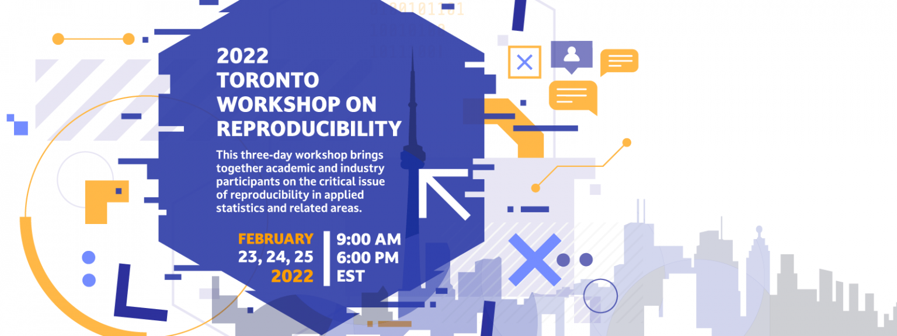

## Description 

I had the privilege talking this year at the 2022 Toronto Workshop on Reproducibility Conference. I shared some thoughts on the struggle for reproducibility in Biomedical Research. Because I prepared the talk while completing my dissertation, I did not have time to make some nice `xaringan` slides (sorry, I know). But, the talk was recorded and can be found in the link above. 

The motivation for this talk came from my experience and (constant) struggle with Statistics during the first years of my PhD. It was always hard to understand the _why_ of the Stats I was learning, and the last thing I had on my mind in those early days was how to make my analysis reproducible. We know we have to make research reproducible, but as grad students, we have little knowledge of the tools available to make it happen. 

Basically, my main points in the talk were:

- We need to teach Statistics using data that has a biological context

- When teaching, emphasize tools that make research reproducible

- Let's move away from what I call the 'click' approach to Stats. Unless you write some code, chances are you are not fully understanding what you are doing, and you won't be able to make your work reproducible. 

I was pleased to hear from some people in the audience saying that the talk was useful. That was my purpose (besides doing some therapy from all the Stats inflicted trauma, ha!). We need, and must do better to normalize reproducibility, to help people at their early stages. That saves a lot of headaches and pain later.

Now, I will go back to make my dissertation slides...


```{r, echo=FALSE, out.width = '60%', fig.align='center'}

```

